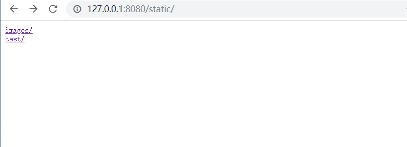
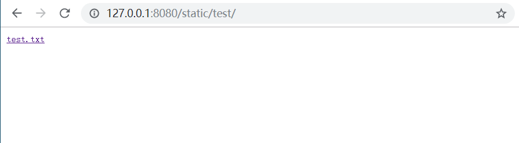
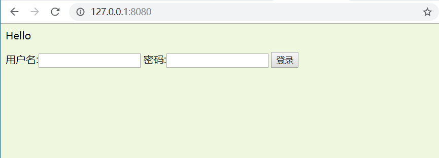
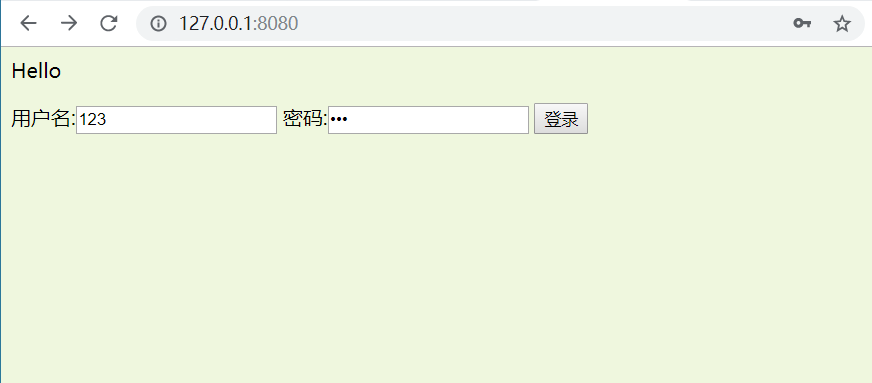
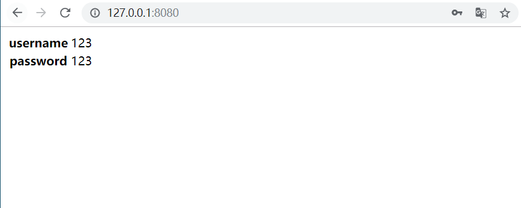
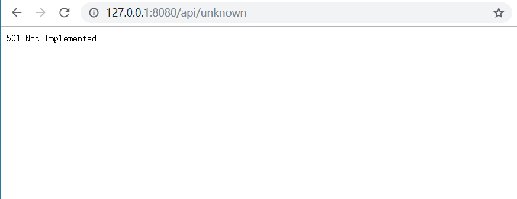

## cloudgo-io

1. 支持静态文件服务
2. 支持简单 js 访问
3. 提交表单，并输出一个表格
4. 对 `/unknown` 给出开发中的提示，返回码 `5xx`

#### 使用方法

​		在当前文件夹终端输入`go run main.go`即开始运行

#### 运行效果

- 静态文件服务：

​		运行程序后在浏览器中输入`127.0.0.1:8080/static`

- 简单js访问：

- 提交表单，并输出一个表格

- 对 `/unknown` 给出开发中的提示，返回码 `5xx`

